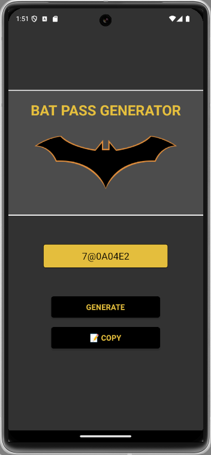

# BatPassword - Gerador de Senhas Aleatórias 🦇🔑

**BatPassword** é um aplicativo mobile desenvolvido em **React Native** com **Expo**, que gera senhas aleatórias de forma simples e divertida, com uma temática inspirada no Batman. Ele possui uma interface minimalista com dois botões principais: um para **gerar senhas** e outro para **copiar a senha gerada** para a área de transferência.



---

## 📱 **Funcionalidades**

- **Gerador de Senhas Aleatórias**:
  - Cria senhas seguras com caracteres alfanuméricos.
  - Comprimento das senhas configurado para 8 caracteres.

- **Cópia para Área de Transferência**:
  - Permite copiar a senha gerada com um único clique.
  - Exibe uma mensagem de confirmação após a cópia: _"Copiado para transferência!"_.

- **Design Temático**:
  - Interface com elementos estilizados para representar a atmosfera sombria e icônica do universo do Batman.

---

## 🛠️ **Tecnologias Utilizadas**

- **[React Native](https://reactnative.dev/)**: Framework para desenvolvimento mobile.
- **[Expo](https://expo.dev/)**: Plataforma para desenvolvimento rápido de aplicativos React Native.
- **[expo-clipboard](https://docs.expo.dev/versions/latest/sdk/clipboard/)**: Biblioteca para interação com a área de transferência.
- **JavaScript/TypeScript**: Linguagens de desenvolvimento.

---

## 🎨 **Interface**

O aplicativo é composto por uma única tela com os seguintes elementos:

1. **Campo de Exibição da Senha**:
   - Mostra a senha gerada pelo aplicativo.
   
2. **Botão "GENERATE"**:
   - Gera uma nova senha aleatória ao ser pressionado.
   
3. **Botão "📝 COPY"**:
   - Copia a senha gerada para a área de transferência e exibe a mensagem de confirmação.

4. **Mensagem de Feedback**:
   - Mostra uma mensagem temporária como:
     - _"Copiado para transferência!"_ quando a senha é copiada.
     - _"Nada para copiar!"_ caso não exista uma senha para copiar.

---

## 🚀 **Como Executar o Projeto**

1. **Clone este repositório**:
   ```bash
   git clone https://github.com/lucas-rech/DIO-Courses.git
   cd formaca-react-native
   cd password-generator-app
   ```

2. **Instale as dependências**:
   ```bash
   npm install
   ```

3. **Execute o aplicativo**:
   ```bash
   expo start
   ```

4. **Teste no seu dispositivo**:
   - Escaneie o QR Code exibido no terminal usando o aplicativo Expo Go (disponível na App Store e Google Play).

---

## 🛠️ **Estrutura do Projeto**

```
BatPassword/
├── src/
│   ├── components/
│   │   ├── BatButton/
│   │   │   ├── BatButton.js
│   │   │   ├── BatButtonStyles.js
│   │   ├── BatTextInput/
│   │   │   ├── BatTextInput.js
│   ├── services/
│   │   ├── passwordService.js  # Lógica de geração de senhas
│   ├── App.js                  # Arquivo principal
├── package.json
└── README.md
```

---

## 🌟 **Estilo do Aplicativo**

- O design utiliza cores escuras, como preto e cinza, com detalhes em amarelo para representar o Bat-sinal.
- As fontes são simples e legíveis, refletindo o minimalismo funcional do universo do Batman.

---

## 📦 **Dependências Principais**

- `expo`: Plataforma para desenvolvimento mobile.
- `react`: Biblioteca JavaScript para construção de interfaces.
- `react-native`: Biblioteca para desenvolvimento mobile.
- `expo-clipboard`: Biblioteca para interagir com a área de transferência.

---

## 🤝 **Contribuição**

Se você deseja contribuir para este projeto:

1. Faça um **fork** do repositório.
2. Crie uma nova branch:
   ```bash
   git checkout -b feature/minha-nova-feature
   ```
3. Faça suas alterações e realize o commit:
   ```bash
   git commit -m "Minha nova feature"
   ```
4. Envie para o repositório remoto:
   ```bash
   git push origin feature/minha-nova-feature
   ```
5. Abra um **Pull Request**.

---

## 📄 **Licença**

Este projeto é licenciado sob a **MIT License**. Consulte o arquivo `LICENSE` para mais detalhes.

---

## 🦇 **Curiosidade**

> "Eu sou a noite. Eu sou a senha!" — Este é o aplicativo que o próprio Batman usaria para proteger seus segredos na Batcaverna! 🦇

--- 

Desenvolvido com 💛 pela comunidade de desenvolvedores React Native.
